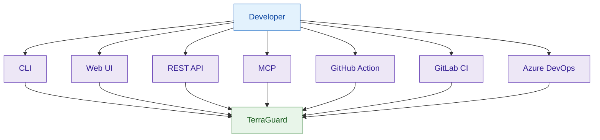
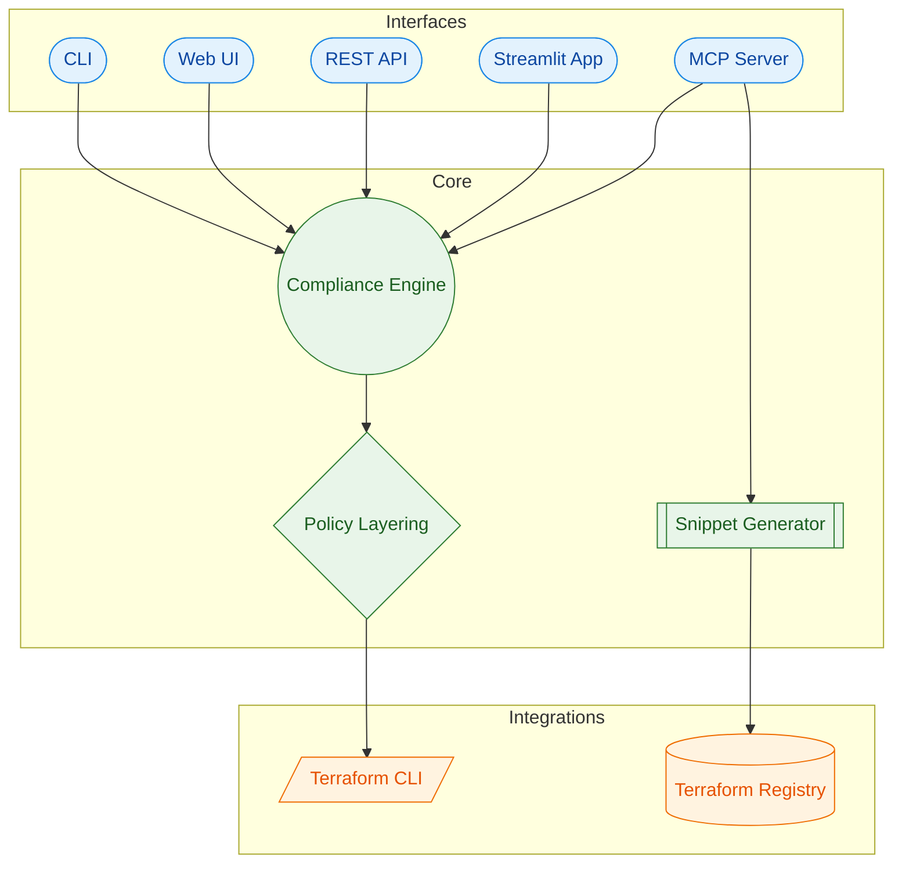
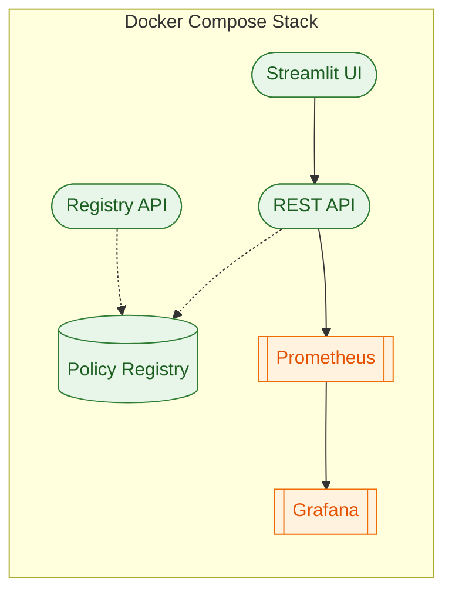

# Terraform Guardrail MCP (TerraGuard)

[](https://github.com/Huzefaaa2/terraform-guardrail/actions/workflows/ci.yml)

Terraform Guardrail MCP (TerraGuard) (Model Context Protocol) is an enterprise-grade IaC governance
and guardrail platform that enforces architectural intent, compliance, and platform standards
directly inside CI/CD. It runs outside Terraform and gives AI assistants and platform teams real
provider context, policy intelligence, and auditable guardrails so every change is safer by default.
The result is a cleaner state, fewer failures, and a shorter path from idea to production.

This product is built for teams shipping infrastructure at scale who need speed without sacrificing
safety. Guardrail enforces non-negotiable platform invariants, allows composable product constraints,
and produces human-readable reports that make decisions obvious and defensible.

Live app: https://terraform-guardrail.streamlit.app/

## Terraform-Guardrail MCP (TerraGuard)

**Making Infrastructure Governance Executable**

## The Problem We’re Solving

Despite using Terraform and security scanners, enterprises still face:

- Inconsistent enforcement across teams
- Policies applied too late in delivery
- Manual reviews that don’t scale
- Different interpretations of “standards”
- Audit findings caused by drift, not intent

👉 The issue is not lack of tools —  
👉 The issue is lack of a governance distribution mechanism.

## What Terraform-Guardrail MCP Is

Terraform-Guardrail MCP is an enterprise-grade IaC governance and guardrail platform for Terraform
that enforces architectural intent, compliance, and platform standards directly in CI/CD.

It:

- Establishes a non-negotiable safety floor
- Distributes guardrails consistently via CI/CD
- Enables progressive enforcement (Advisory → Warn → Strict)
- Makes governance versioned, auditable, and repeatable

Governance becomes code, not documents.

## Where It Fits (Ecosystem View)

| Layer | Role |
| --- | --- |
| Terraform-Guardrail MCP | Governance & enforcement orchestration |
| Checkov / tfsec / Terrascan | Deep static security & compliance scanning |
| OPA / Sentinel | Advanced & runtime policy enforcement |
| CI/CD (GitLab/GitHub) | Execution & control point |

Terraform-Guardrail does not replace existing tools — it connects and operationalizes them.

## How It Works (In One Line)

Every Terraform change passes through the same guardrails, before it ever reaches the cloud.

Implemented at:

- Merge request / pull request stage
- GitLab group-level CI enforcement
- No per-repo negotiation

## Enterprise Adoption Model

| Phase | Mode | Business Outcome |
| --- | --- | --- |
| Phase 1 | Advisory | Visibility, zero disruption |
| Phase 2 | Warn | Accountability without blocking |
| Phase 3 | Strict | Mandatory compliance for prod |

✔ No “big-bang” rollout  
✔ Teams keep autonomy above the safety floor

## Why Enterprises Adopt Terraform-Guardrail

Without it:

- Governance relies on people & process
- Controls drift over time
- Audit remediation is expensive

With it:

- Governance is automatic and consistent
- Security shifts left into CI
- Audit evidence is generated by default
- Platform teams scale without becoming bottlenecks

## Bottom Line (Executive Takeaway)

Terraform-Guardrail MCP turns infrastructure governance  
from guidelines into guarantees.

It enables speed and safety — without trading one for the other.

## Design Principle

Non-negotiable safety floor, composable freedom above it. Guardrails live outside Terraform so
platform teams can enforce baseline invariants while product teams retain agility.

## User Perspective (High-Level)

```mermaid
flowchart LR
    USER[Platform + Product Teams] --> CHANNELS[CLI / UI / REST API / CI]
    CHANNELS --> GUARDRAIL[TerraGuard Control Plane]
    GUARDRAIL --> POLICIES[Baseline + Context Policies]
    GUARDRAIL --> REPORTS[Guidance + Evidence]
    GUARDRAIL --> TERRAFORM[Safer Terraform Applies]

    classDef actor fill:#e3f2fd,stroke:#1565c0,stroke-width:1px,color:#0d47a1;
    classDef channel fill:#f3e5f5,stroke:#6a1b9a,stroke-width:1px,color:#4a148c;
    classDef core fill:#e8f5e9,stroke:#2e7d32,stroke-width:1px,color:#1b5e20;
    classDef output fill:#fff3e0,stroke:#ef6c00,stroke-width:1px,color:#e65100;

    class USER actor;
    class CHANNELS channel;
    class GUARDRAIL, POLICIES core;
    class REPORTS, TERRAFORM output;
```

## Ways Developers Use Guardrail



## Current Capabilities

- Multi-file scanning with summaries and CSV export
- Secret hygiene checks across `.tf`, `.tfvars`, and `.tfstate`
- Schema-aware validation with Terraform CLI integration
- Provider metadata lookup via Terraform Registry
- MCP tools for scan, metadata, and snippet generation
- Streamlit and web UI for instant reporting
- Dockerized REST API for CI/CD adoption
- Docker Compose dev stack (API + UI + policy registry, optional analytics)
- OPA bundle-ready policy registry for guardrail packs
- Policy evaluation via OPA bundles with optional signature verification
- Minimal policy registry API (versions + audit history)

## Supported Providers

- AWS
- Azure
- GCP
- Kubernetes
- Helm
- OCI
- Vault
- Alicloud
- vSphere

## Feature Matrix

| Area | CLI | Web UI / Streamlit |
| --- | --- | --- |
| Config scan (`.tf`, `.tfvars`, `.hcl`) | Yes | Yes |
| State leak scan (`.tfstate`) | Yes | Yes |
| Schema-aware validation | Yes | Yes |
| CSV export | No | Yes |
| Provider metadata | Yes | Yes |
| Snippet generation | Yes | No |
| Multi-file scan | Yes (directory) | Yes (upload up to 10) |
| Human-readable report | Yes | Yes |
| Policy bundle registry | Yes | No |
| Policy evaluation (OPA bundles) | Yes | No |

## Architecture (High-Level)



## Architecture (Detailed Flow)


Note: Mermaid diagrams render on GitHub and in the Wiki. PyPI will show the raw blocks.

## Roadmap (Major Releases)

Legend: <span style="color: green">✅ Delivered</span> • <span style="color: orange">🚧 Planned</span>

| Deliverable | v1.0 Foundation | v2.0 Enterprise | v3.0 Ecosystem | v4.0 Intelligent | Docs |
| --- | --- | --- | --- | --- | --- |
| Dockerized MCP + REST API | <span style="color: green">✅ Delivered (0.2.x)</span> |  |  |  | [Docs](https://github.com/Huzefaaa2/terraform-guardrail/wiki/REST-API) |
| CLI-first install | <span style="color: green">✅ Delivered (0.2.x)</span> |  |  |  | [Docs](https://github.com/Huzefaaa2/terraform-guardrail/wiki/Packaging) |
| Docker Compose local stack (API + UI + registry) | <span style="color: green">✅ Delivered (0.2.x)</span> |  |  |  | [Docs](https://github.com/Huzefaaa2/terraform-guardrail/wiki/Docker-Compose) |
| GitHub Action pre-apply / PR checks | <span style="color: green">✅ Delivered (0.2.x)</span> |  |  |  | [Docs](https://github.com/Huzefaaa2/terraform-guardrail/wiki/GitHub-Action) |
| Central guardrail registry | <span style="color: green">✅ Delivered (1.0.x)</span> |  |  |  | [Docs](https://github.com/Huzefaaa2/terraform-guardrail/wiki/Policy-Registry) |
| Policy versioning + audit trail | <span style="color: green">✅ Delivered (1.0.x)</span> |  |  |  | [Docs](https://github.com/Huzefaaa2/terraform-guardrail/wiki/Policy-Registry) |
| Registry service image (GHCR) | <span style="color: green">✅ Delivered (1.0.x)</span> |  |  |  | [Docs](https://github.com/Huzefaaa2/terraform-guardrail/wiki/Packaging) |
| Homebrew package (macOS) | <span style="color: green">✅ Delivered (1.0.x)</span> |  |  |  | [Docs](https://github.com/Huzefaaa2/terraform-guardrail/wiki/Packaging) |
| Chocolatey package (Windows) | <span style="color: green">✅ Delivered (1.0.x)</span> |  |  |  | [Docs](https://github.com/Huzefaaa2/terraform-guardrail/wiki/Packaging) |
| Linux install script (curl \| bash) | <span style="color: green">✅ Delivered (1.0.x)</span> |  |  |  | [Docs](https://github.com/Huzefaaa2/terraform-guardrail/wiki/Packaging) |
| GitLab CI templates | <span style="color: green">✅ Delivered (1.0.x)</span> |  |  |  | [Docs](https://github.com/Huzefaaa2/terraform-guardrail/wiki/GitLab-CI) |
| Azure DevOps / Pipeline extension | <span style="color: green">✅ Delivered (1.0.x)</span> |  |  |  | [Docs](https://github.com/Huzefaaa2/terraform-guardrail/wiki/Azure-DevOps) |
| Policy layering model (base → env → app) | <span style="color: orange">🚧 Planned</span> |  |  |  | [Docs](https://github.com/Huzefaaa2/terraform-guardrail/wiki/Policy-Layering) |
| Policy authoring UI |  | <span style="color: orange">🚧 Planned</span> |  |  | [Docs](https://github.com/Huzefaaa2/terraform-guardrail/wiki/Policy-Authoring-UI) |
| Policy metadata + rich failure messages |  | <span style="color: orange">🚧 Planned</span> |  |  | [Docs](https://github.com/Huzefaaa2/terraform-guardrail/wiki/Policy-Metadata) |
| Drift-prevention rules before apply |  | <span style="color: orange">🚧 Planned</span> |  |  | [Docs](https://github.com/Huzefaaa2/terraform-guardrail/wiki/Drift-Prevention) |
| Org-wide baselines |  | <span style="color: orange">🚧 Planned</span> |  |  | [Docs](https://github.com/Huzefaaa2/terraform-guardrail/wiki/Org-Wide-Baselines) |
| Group-level enforcement |  | <span style="color: orange">🚧 Planned</span> |  |  | [Docs](https://github.com/Huzefaaa2/terraform-guardrail/wiki/Group-Level-Enforcement) |
| Evidence export (SOC2 / ISO / PCI) |  | <span style="color: orange">🚧 Planned</span> |  |  | [Docs](https://github.com/Huzefaaa2/terraform-guardrail/wiki/Evidence-Export) |
| Contributor governance + public roadmap |  |  | <span style="color: orange">🚧 Planned</span> |  | [Docs](https://github.com/Huzefaaa2/terraform-guardrail/wiki/Governance) |
| Reference implementations across tools |  |  | <span style="color: orange">🚧 Planned</span> |  | [Docs](https://github.com/Huzefaaa2/terraform-guardrail/wiki/Reference-Implementations) |
| Cross-provider invariant enforcement |  |  | <span style="color: orange">🚧 Planned</span> |  | [Docs](https://github.com/Huzefaaa2/terraform-guardrail/wiki/Cross-Provider-Invariants) |
| Guardrails-as-a-Service API |  |  | <span style="color: orange">🚧 Planned</span> |  | [Docs](https://github.com/Huzefaaa2/terraform-guardrail/wiki/Guardrails-as-a-Service) |
| Enterprise policy packs |  |  | <span style="color: orange">🚧 Planned</span> |  | [Docs](https://github.com/Huzefaaa2/terraform-guardrail/wiki/Policy-Packs) |
| Context-aware evaluation |  |  |  | <span style="color: orange">🚧 Planned</span> | [Docs](https://github.com/Huzefaaa2/terraform-guardrail/wiki/Context-Aware-Evaluation) |
| Suggested fixes + recommendations |  |  |  | <span style="color: orange">🚧 Planned</span> | [Docs](https://github.com/Huzefaaa2/terraform-guardrail/wiki/Suggested-Fixes) |

## Comparison with Other Tools

Terraform Guardrail MCP (TerraGuard) takes a fundamentally different approach to IaC governance than traditional
scanning or linting tools. Guardrail is delivered as a Model Context Protocol (MCP) server with a
CLI and web UI. It runs outside Terraform, exposing provider metadata, scanning configs and state
for sensitive values, and producing human-readable reports. Its rules engine focuses on secret
hygiene and write-only arguments and lets platform teams publish non-negotiable guardrails while
product teams compose contextual constraints.

By contrast, existing tools such as Checkov, TFLint and OPA/Conftest operate mainly as static code
analyzers embedded in CI pipelines. They scan Terraform files or plans for misconfigurations but do
not provide a centralized control plane or cross-provider context. The table below summarizes the
key differences:

| Category | Guardrail MCP | Checkov | TFLint | OPA/Conftest |
| --- | --- | --- | --- | --- |
| Primary purpose | External IaC governance control plane | Static multi-IaC security scanner | Terraform linter | General policy engine (Rego) |
| IaC support | Terraform + multi-cloud providers (AWS, Azure, GCP, Kubernetes, Helm, OCI, Vault, vSphere, Alicloud) | Terraform, CloudFormation, Kubernetes, Helm, ARM, Serverless | Terraform (HCL) | Any domain via Rego policies |
| Policy model | Central guardrail registry; platform invariants + product constraints; versioned and auditable | Built-in rules (Python/Rego) + custom policies | Provider-specific rule plugins; experimental Rego plugin | Rego rules only |
| Enforcement stage | Pre-apply; prevents bad state and drift; uses provider schemas | Pre-apply scan of templates and plans | Pre-apply linting for errors and best-practice drifts | Pre-apply checks (via Conftest) – outcome depends on integration |
| Governance & audit | Org-level guardrail registry, ownership boundaries, audit trail | No policy lifecycle management | No policy registry | No governance features |
| Developer experience | CLI/Server/Web UI; human-readable reports & fix suggestions | CLI with JSON/SARIF/JUnit output and graph insights | CLI with JSON/SARIF/JUnit output; configurable warnings | CLI library; steep learning curve |

### Why Guardrail complements scanners

Checkov provides a vast policy library and graph-based resource analysis to catch misconfigurations
early, and TFLint offers pluggable, provider-aware linting rules to detect invalid types, deprecated
syntax and best-practice drifts. These tools remain valuable for static analysis of Terraform code.
Guardrail MCP builds upon them by acting as a higher-order control plane: it uses provider metadata
to validate schema usage, prevents secret leakage and drift before Terraform mutates state, and
separates platform-owned safety floors from product-level constraints. In practice, teams often run
TFLint or Checkov in their CI to catch coding errors while Guardrail serves as the last line of
defense to enforce organizational guardrails and deliver contextual guidance.

## Quickstart

```bash
python -m venv .venv
source .venv/bin/activate
pip install -e "[dev]"

# CLI scan
terraform-guardrail scan examples

# snippet generation
terraform-guardrail generate aws aws_s3_bucket --name demo

# list policy bundles
terraform-guardrail policy list

# registry API
terraform-guardrail registry-api

# MCP server (stdio)
terraform-guardrail mcp

# Web UI
terraform-guardrail web
```

## Install from PyPI

```bash
pip install terraform-guardrail
```

PyPI: https://pypi.org/project/terraform-guardrail/ (latest: 1.0.4)

## Installer Options

Packaging artifacts are generated on release tags. Homebrew and Chocolatey publishes are enabled
when the release secrets are configured.

### Homebrew (macOS)

```bash
brew install Huzefaaa2/tap/terraform-guardrail
```

### Chocolatey (Windows)

```powershell
choco install terraform-guardrail
```

### Linux (curl | bash)

```bash
curl -sSL https://github.com/Huzefaaa2/terraform-guardrail/releases/latest/download/install.sh | bash
```

Packaging details: `docs/packaging.md`.

## CLI examples

```bash
# scan a directory
terraform-guardrail scan ./examples --format json

# scan state files too
terraform-guardrail scan ./examples --state ./examples/sample.tfstate

# enable schema-aware validation (requires terraform CLI + initialized workspace)
terraform-guardrail scan ./examples --schema

# evaluate OPA policy bundle (requires opa CLI)
terraform-guardrail scan ./examples --policy-bundle baseline

# fail CI on medium+ findings
terraform-guardrail scan ./examples --fail-on medium
```

## Web UI

Visit `http://127.0.0.1:8000` and upload a Terraform file to view a compliance report.

## Streamlit App

```bash
streamlit run streamlit_app.py
```

Live app: https://terraform-guardrail.streamlit.app/

### Streamlit Cloud deployment

1. Push this repo to GitHub.
2. Create a new Streamlit Cloud app.
3. Set the main file path to `streamlit_app.py`.
4. Deploy (Streamlit will install from `requirements.txt`).

## REST API (Docker)

Build and run the API server:

```bash
docker build -t terraform-guardrail .
docker run --rm -p 8080:8080 terraform-guardrail
```

API endpoints:

- `GET /health`
- `GET /metrics`
- `POST /scan`
- `POST /provider-metadata`
- `GET /policy-bundles`
- `GET /policy-bundles/{bundle_id}`
- `POST /generate-snippet`

Example request:

```bash
curl -X POST http://localhost:8080/scan \\
  -H "Content-Type: application/json" \\
  -d '{"path":"./examples","use_schema":false}'
```

## Container Image

Pull the published container image (built on release tags):

```bash
docker pull ghcr.io/huzefaaa2/terraform-guardrail:latest
```

Run it:

```bash
docker run --rm -p 8080:8080 ghcr.io/huzefaaa2/terraform-guardrail:latest
```

Registry API image:

```bash
docker pull ghcr.io/huzefaaa2/terraform-guardrail-registry:latest
docker run --rm -p 8090:8090 ghcr.io/huzefaaa2/terraform-guardrail-registry:latest
```

## Docker Compose Stack (Local Dev)

Bring up API + Streamlit UI + policy registry:

```bash
docker compose up --build
```

Enable optional analytics (Prometheus + Grafana):

```bash
docker compose --profile analytics up --build
```

Service URLs:

- API: http://localhost:8080
- Streamlit UI: http://localhost:8501
- Policy registry (static): http://localhost:8081
- Policy registry API: http://localhost:8090
- Prometheus (analytics profile): http://localhost:9090
- Grafana (analytics profile): http://localhost:3000 (admin / guardrail)

More details: `docs/docker-compose-guide.md`.

## Policy Registry (OPA Bundles)

The local policy registry exposes OPA bundles for guardrail packs. Fetch bundles with the CLI:

```bash
terraform-guardrail policy list
terraform-guardrail policy fetch baseline --destination ./policies
terraform-guardrail policy fetch baseline-signed --destination ./policies
```

Policy evaluation runs only when `--policy-bundle` is provided. If a bundle includes verification
settings (public key + scope), the OPA CLI validates bundle signatures before evaluation.

Registry API (Compose): `GET /bundles`, `GET /bundles/{id}/versions`, `GET /audit`.

Signed bundle example:

- Bundle: `baseline-signed`
- Public key: `http://localhost:8081/keys/guardrail.pub`



## GitHub Action (Pre-apply / PR checks)

Use the built-in action to scan Terraform changes on pull requests:

```yaml
name: Guardrail

on:
  pull_request:
    paths:
      - "**/*.tf"
      - "**/*.tfvars"
      - "**/*.hcl"
      - "**/*.tfstate"

jobs:
  guardrail:
    runs-on: ubuntu-latest
    steps:
      - uses: actions/checkout@v4
      - name: Start local policy registry
        run: |
          python -m http.server 8081 --directory ops/policy-registry &
      - uses: ./.github/actions/guardrail
        with:
          path: .
          fail_on: medium
          install_source: repo
          policy_bundle: baseline-signed
          policy_registry: http://localhost:8081
```

When `policy_bundle` is set, the action installs OPA automatically and validates signatures (if
configured).

## GitLab CI Templates

Include the shared template in your `.gitlab-ci.yml`:

```yaml
include:
  - project: "Huzefaaa2/terraform-guardrail"
    ref: "v1.0.4"
    file: "/.gitlab/terraform-guardrail.yml"
```

Override variables as needed:

```yaml
variables:
  TERRAFORM_GUARDRAIL_SCAN_PATH: "infra"
  TERRAFORM_GUARDRAIL_FAIL_ON: "high"
  TERRAFORM_GUARDRAIL_FORMAT: "pretty"
  TERRAFORM_GUARDRAIL_JSON_REPORT: "guardrail-report.json"
  TERRAFORM_GUARDRAIL_WRITE_REPORT: "true"
  TERRAFORM_GUARDRAIL_SARIF_REPORT: "guardrail-report.sarif"
  TERRAFORM_GUARDRAIL_JUNIT_REPORT: "guardrail-report.junit.xml"
  TERRAFORM_GUARDRAIL_WRITE_SARIF: "true"
  TERRAFORM_GUARDRAIL_WRITE_JUNIT: "true"
```

Optional policy bundle evaluation:

```yaml
guardrail_scan:
  before_script:
    - python -m http.server 8081 --directory ops/policy-registry &
  variables:
    TERRAFORM_GUARDRAIL_POLICY_BUNDLE: "baseline-signed"
    TERRAFORM_GUARDRAIL_POLICY_REGISTRY: "http://localhost:8081"
```

The template emits JSON, SARIF, and JUnit report artifacts by default. Disable any of them with
`TERRAFORM_GUARDRAIL_WRITE_REPORT`, `TERRAFORM_GUARDRAIL_WRITE_SARIF`, or
`TERRAFORM_GUARDRAIL_WRITE_JUNIT`.

## Azure DevOps Pipelines

Use the pipeline template in `/.azure/terraform-guardrail.yml`.

```yaml
trigger:
  - main

pool:
  vmImage: "ubuntu-latest"

steps:
  - template: .azure/terraform-guardrail.yml
    parameters:
      path: "infra"
      failOn: "high"
      policyBundle: "baseline-signed"
      policyRegistry: "http://localhost:8081"
```

The template publishes JSON, SARIF, and JUnit reports. Disable publishing with
`publishReports: false`.

## Azure DevOps Marketplace Extension

The repo also includes a Marketplace extension scaffold in `azure-devops-extension/` with a
`Terraform Guardrail Scan` task. Build it using `tfx` and publish from your ADO publisher account.

## Release Links

- PyPI: https://pypi.org/project/terraform-guardrail/
- GitHub Releases: https://github.com/Huzefaaa2/terraform-guardrail/releases
- Container Image: https://github.com/Huzefaaa2/terraform-guardrail/pkgs/container/terraform-guardrail
- Latest release: v1.0.4
- Release history: `RELEASE.md`
- Enterprise Features: https://github.com/Huzefaaa2/terraform-guardrail/wiki/Enterprise-Features

## Licensing

Terraform-Guardrail is released under the **Business Source License (BSL) 1.1**.

### What this means

✅ Free to use for:
- Internal enterprise platforms
- CI/CD pipelines
- Evaluation, learning, and experimentation
- Open-source contributions

❌ Not allowed without permission:
- Offering Terraform-Guardrail as a paid product or SaaS
- Embedding it into commercial platforms or services
- Reselling or monetizing the software directly

### Commercial Usage

Commercial use requires **explicit written permission** from the author.

If you wish to:
- Offer Terraform-Guardrail as a managed service
- Embed it into a commercial platform
- Distribute it as part of a paid product

Please contact the author to discuss licensing options.

### Licensing FAQ

**Q: Can I use Terraform-Guardrail inside my company?**  
Yes. Internal use and CI/CD validation are allowed without permission.

**Q: Can I offer it as a paid SaaS or managed service?**  
No. Paid or monetized use requires explicit written permission.

**Q: When does it become Apache 2.0?**  
On the Change Date defined in the LICENSE (4 years from first public release).

See `LICENSE` and `COMMERCIAL_USAGE.md` for full terms.

## Deployment Guide

See `docs/streamlit_cloud.md` for a detailed Streamlit Cloud walkthrough.

## Release Checklist

- Update version in `pyproject.toml`.
- Update `RELEASE_NOTES.md` and `CHANGELOG.md`.
- Commit changes and push to `main`.
- Create and push a tag: `git tag -a vX.Y.Z -m "vX.Y.Z"` then `git push origin vX.Y.Z`.
- Confirm GitHub Actions release workflow completed successfully.

## Changelog Automation

This repo uses `git-cliff` to generate `CHANGELOG.md`.

```bash
git cliff -o CHANGELOG.md
```

Or run:

```bash
make changelog
```

### Release Helpers

```bash
make release-dry VERSION=1.0.4
make version-bump VERSION=1.0.4
```

## MCP tools (current)

- `scan_terraform`: Run compliance checks over a path and optional state file.
- `get_provider_metadata`: Fetch provider metadata from Terraform Registry.
- `generate_snippet`: Generate Terraform snippets for common resources.

## License

MIT
