# Terraform Guardrail MCP

[](https://github.com/Huzefaaa2/terraform-guardrail/actions/workflows/ci.yml)

Terraform Guardrail MCP (Model Context Protocol) is a governance control plane for Infrastructure as
Code. It runs outside Terraform and gives AI assistants and platform teams real provider context,
policy intelligence, and auditable guardrails so every change is safer by default. The result is a
cleaner state, fewer failures, and a shorter path from idea to production.

This product is built for teams shipping infrastructure at scale who need speed without sacrificing
safety. Guardrail enforces non-negotiable platform invariants, allows composable product constraints,
and produces human-readable reports that make decisions obvious and defensible.

Live app: https://terraform-guardrail.streamlit.app/

## Design Principle

Non-negotiable safety floor, composable freedom above it. Guardrails live outside Terraform.

## User Perspective (High-Level)

```mermaid
flowchart LR
    USER[Platform + Product Teams] --> CHANNELS[CLI • Streamlit • REST API • MCP]
    CHANNELS --> GUARDRAIL[Terraform Guardrail MCP]
    GUARDRAIL --> REPORTS[Readable Guidance + Evidence]
    GUARDRAIL --> TERRAFORM[Safer Terraform Applies]
```



## Ways Developers Use Guardrail


## Current Capabilities

- Multi-file scanning with summaries and CSV export
- Secret hygiene checks across `.tf`, `.tfvars`, and `.tfstate`
- Schema-aware validation with Terraform CLI integration
- Provider metadata lookup via Terraform Registry
- MCP tools for scan, metadata, and snippet generation
- Streamlit and web UI for instant reporting
- Dockerized REST API for CI/CD adoption

## Supported Providers

- AWS
- Azure
- GCP
- Kubernetes
- Helm
- OCI
- Vault
- Alicloud
- vSphere

## Feature Matrix

| Area | CLI | Web UI / Streamlit |
| --- | --- | --- |
| Config scan (`.tf`, `.tfvars`, `.hcl`) | Yes | Yes |
| State leak scan (`.tfstate`) | Yes | Yes |
| Schema-aware validation | Yes | Yes |
| CSV export | No | Yes |
| Provider metadata | Yes | Yes |
| Snippet generation | Yes | No |
| Multi-file scan | Yes (directory) | Yes (upload up to 10) |
| Human-readable report | Yes | Yes |

## Architecture (High-Level)


## Architecture (Detailed Flow)

```mermaid
flowchart TB
    INPUTS[Inputs: .tf, .tfvars, .tfstate] --> PARSE[Parse & Normalize]
    PARSE --> SCHEMA[Provider Schema + Metadata]
    SCHEMA --> RULES[Apply Guardrail Rules]
    RULES --> REPORT[Findings + Summary]
    REPORT --> OUTPUTS[CLI JSON • UI • MCP • REST]
```



Note: Mermaid diagrams render on GitHub and in the Wiki. PyPI will show the raw blocks.

## Roadmap (Major Releases)

Legend: <span style="color: green">✅ Delivered</span> • <span style="color: orange">🚧 Under construction</span>

| Deliverable | v1.0 Foundation | v2.0 Enterprise | v3.0 Ecosystem | v4.0 Intelligent |
| --- | --- | --- | --- | --- |
| Dockerized MCP + REST API | <span style="color: green">✅ Delivered (0.2.x)</span> |  |  |  |
| CLI-first install | <span style="color: green">✅ Delivered (0.2.x)</span> |  |  |  |
| GitHub Action pre-apply / PR checks | <span style="color: orange">🚧 Planned</span> |  |  |  |
| Azure DevOps / Pipeline extension | <span style="color: orange">🚧 Planned</span> |  |  |  |
| Policy layering model (base → env → app) | <span style="color: orange">🚧 Planned</span> |  |  |  |
| Policy metadata + rich failure messages |  | <span style="color: orange">🚧 Planned</span> |  |  |
| Drift-prevention rules before apply |  | <span style="color: orange">🚧 Planned</span> |  |  |
| Central guardrail registry |  | <span style="color: orange">🚧 Planned</span> |  |  |
| Policy versioning + audit trail |  | <span style="color: orange">🚧 Planned</span> |  |  |
| Contributor governance + public roadmap |  |  | <span style="color: orange">🚧 Planned</span> |  |
| Reference implementations across tools |  |  | <span style="color: orange">🚧 Planned</span> |  |
| Cross-provider invariant enforcement |  |  | <span style="color: orange">🚧 Planned</span> |  |
| Context-aware evaluation |  |  |  | <span style="color: orange">🚧 Planned</span> |
| Suggested fixes + recommendations |  |  |  | <span style="color: orange">🚧 Planned</span> |

## Comparison with Other Tools

Terraform Guardrail MCP takes a fundamentally different approach to IaC governance than traditional
scanning or linting tools. Guardrail is delivered as a Model Context Protocol (MCP) server with a
CLI and web UI. It runs outside Terraform, exposing provider metadata, scanning configs and state
for sensitive values, and producing human-readable reports. Its rules engine focuses on secret
hygiene and write-only arguments and lets platform teams publish non-negotiable guardrails while
product teams compose contextual constraints.

By contrast, existing tools such as Checkov, TFLint and OPA/Conftest operate mainly as static code
analyzers embedded in CI pipelines. They scan Terraform files or plans for misconfigurations but do
not provide a centralized control plane or cross-provider context. The table below summarizes the
key differences:

| Category | Guardrail MCP | Checkov | TFLint | OPA/Conftest |
| --- | --- | --- | --- | --- |
| Primary purpose | External IaC governance control plane | Static multi-IaC security scanner | Terraform linter | General policy engine (Rego) |
| IaC support | Terraform + multi-cloud providers (AWS, Azure, GCP, Kubernetes, Helm, OCI, Vault, vSphere, Alicloud) | Terraform, CloudFormation, Kubernetes, Helm, ARM, Serverless | Terraform (HCL) | Any domain via Rego policies |
| Policy model | Central guardrail registry; platform invariants + product constraints; versioned and auditable | Built-in rules (Python/Rego) + custom policies | Provider-specific rule plugins; experimental Rego plugin | Rego rules only |
| Enforcement stage | Pre-apply; prevents bad state and drift; uses provider schemas | Pre-apply scan of templates and plans | Pre-apply linting for errors and best-practice drifts | Pre-apply checks (via Conftest) – outcome depends on integration |
| Governance & audit | Org-level guardrail registry, ownership boundaries, audit trail | No policy lifecycle management | No policy registry | No governance features |
| Developer experience | CLI/Server/Web UI; human-readable reports & fix suggestions | CLI with JSON/SARIF/JUnit output and graph insights | CLI with JSON/SARIF/JUnit output; configurable warnings | CLI library; steep learning curve |

### Why Guardrail complements scanners

Checkov provides a vast policy library and graph-based resource analysis to catch misconfigurations
early, and TFLint offers pluggable, provider-aware linting rules to detect invalid types, deprecated
syntax and best-practice drifts. These tools remain valuable for static analysis of Terraform code.
Guardrail MCP builds upon them by acting as a higher-order control plane: it uses provider metadata
to validate schema usage, prevents secret leakage and drift before Terraform mutates state, and
separates platform-owned safety floors from product-level constraints. In practice, teams often run
TFLint or Checkov in their CI to catch coding errors while Guardrail serves as the last line of
defense to enforce organizational guardrails and deliver contextual guidance.

## Quickstart

```bash
python -m venv .venv
source .venv/bin/activate
pip install -e "[dev]"

# CLI scan
terraform-guardrail scan examples

# snippet generation
terraform-guardrail generate aws aws_s3_bucket --name demo

# MCP server (stdio)
terraform-guardrail mcp

# Web UI
terraform-guardrail web
```

## Install from PyPI

```bash
pip install terraform-guardrail
```

PyPI: https://pypi.org/project/terraform-guardrail/ (latest: 0.2.7)

## CLI examples

```bash
# scan a directory
terraform-guardrail scan ./examples --format json

# scan state files too
terraform-guardrail scan ./examples --state ./examples/sample.tfstate

# enable schema-aware validation (requires terraform CLI + initialized workspace)
terraform-guardrail scan ./examples --schema
```

## Web UI

Visit `http://127.0.0.1:8000` and upload a Terraform file to view a compliance report.

## Streamlit App

```bash
streamlit run streamlit_app.py
```

Live app: https://terraform-guardrail.streamlit.app/

### Streamlit Cloud deployment

1. Push this repo to GitHub.
2. Create a new Streamlit Cloud app.
3. Set the main file path to `streamlit_app.py`.
4. Deploy (Streamlit will install from `requirements.txt`).

## REST API (Docker)

Build and run the API server:

```bash
docker build -t terraform-guardrail .
docker run --rm -p 8080:8080 terraform-guardrail
```

API endpoints:

- `GET /health`
- `POST /scan`
- `POST /provider-metadata`
- `POST /generate-snippet`

Example request:

```bash
curl -X POST http://localhost:8080/scan \\
  -H "Content-Type: application/json" \\
  -d '{"path":"./examples","use_schema":false}'
```

## Container Image

Pull the published container image (built on release tags):

```bash
docker pull ghcr.io/huzefaaa2/terraform-guardrail:v0.2.7
```

Run it:

```bash
docker run --rm -p 8080:8080 ghcr.io/huzefaaa2/terraform-guardrail:v0.2.7
```

## Release Links

- PyPI: https://pypi.org/project/terraform-guardrail/
- GitHub Releases: https://github.com/Huzefaaa2/terraform-guardrail/releases
- Container Image: https://github.com/Huzefaaa2/terraform-guardrail/pkgs/container/terraform-guardrail
- Release history: `RELEASE.md`

## Deployment Guide

See `docs/streamlit_cloud.md` for a detailed Streamlit Cloud walkthrough.

## Release Checklist

- Update version in `pyproject.toml`.
- Update `RELEASE_NOTES.md` and `CHANGELOG.md`.
- Commit changes and push to `main`.
- Create and push a tag: `git tag -a vX.Y.Z -m "vX.Y.Z"` then `git push origin vX.Y.Z`.
- Confirm GitHub Actions release workflow completed successfully.

## Changelog Automation

This repo uses `git-cliff` to generate `CHANGELOG.md`.

```bash
git cliff -o CHANGELOG.md
```

Or run:

```bash
make changelog
```

### Release Helpers

```bash
make release-dry VERSION=0.2.7
make version-bump VERSION=0.2.7
```

## MCP tools (current)

- `scan_terraform`: Run compliance checks over a path and optional state file.
- `get_provider_metadata`: Fetch provider metadata from Terraform Registry.
- `generate_snippet`: Generate Terraform snippets for common resources.

## License

MIT
