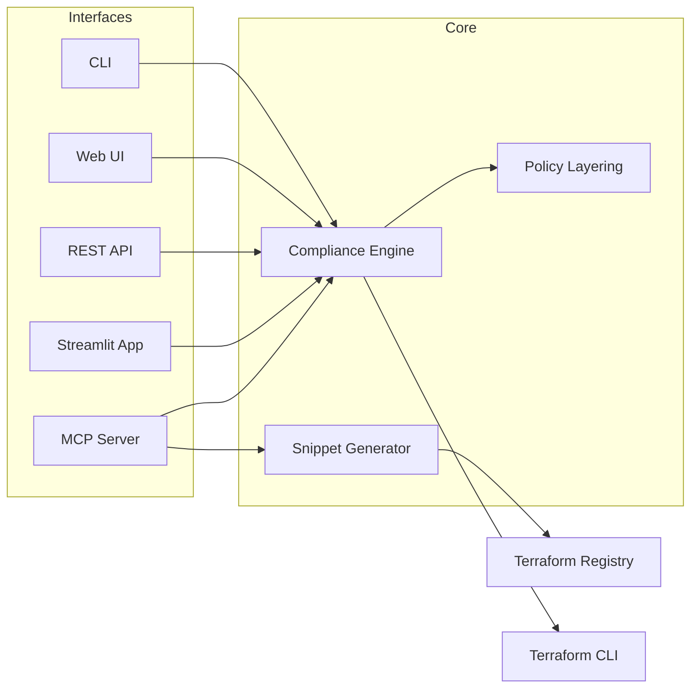
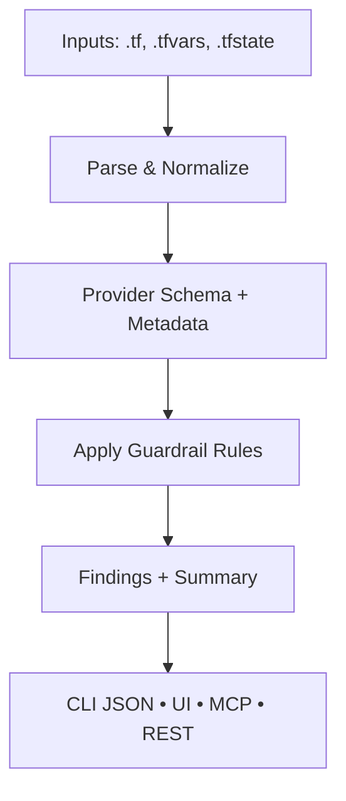
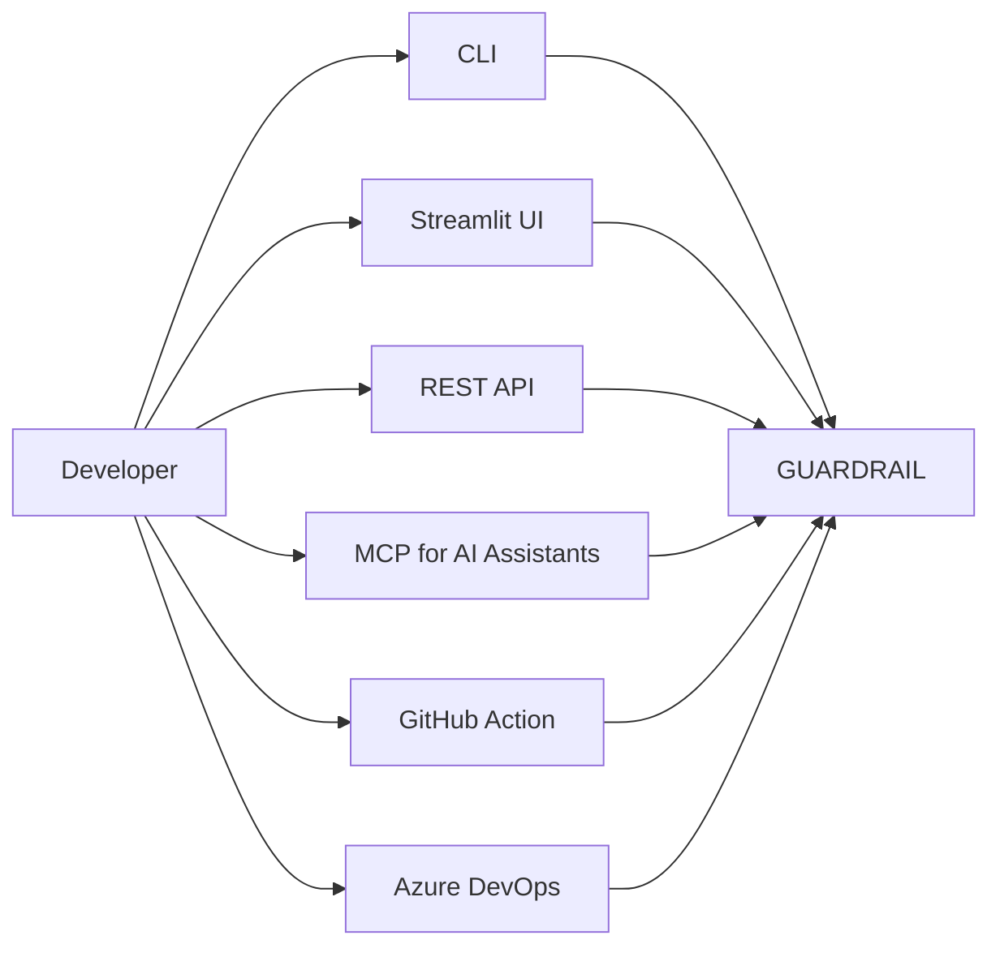

# Architecture

Terraform Guardrail MCP is organized into interfaces, a compliance core, and provider integrations.

## High-Level Architecture

```mermaid
flowchart LR
    subgraph Interfaces
        CLI[CLI]
        MCP[MCP Server]
        WEB[Web UI]
        API[REST API]
        STL[Streamlit App]
    end

    subgraph Core
        SCAN[Compliance Engine]
        GEN[Snippet Generator]
        POLICY[Policy Layering]
    end

    REG[Terraform Registry]
    TF[Terraform CLI]

    CLI --> SCAN
    WEB --> SCAN
    API --> SCAN
    STL --> SCAN
    MCP --> SCAN
    MCP --> GEN
    SCAN --> TF
    GEN --> REG
    SCAN --> POLICY
```

## Detailed Flow

```mermaid
flowchart TB
    INPUTS[Inputs: .tf, .tfvars, .tfstate] --> PARSE[Parse & Normalize]
    PARSE --> SCHEMA[Provider Schema + Metadata]
    SCHEMA --> RULES[Apply Guardrail Rules]
    RULES --> REPORT[Findings + Summary]
    REPORT --> OUTPUTS[CLI JSON • UI • MCP • REST]
```

## Ways to Use Guardrail

```mermaid
flowchart LR
    DEV[Developer] --> CLI[CLI]
    DEV --> UI[Streamlit UI]
    DEV --> API[REST API]
    DEV --> MCP[MCP for AI Assistants]
    DEV --> CI[GitHub Action]
    DEV --> ADO[Azure DevOps]
    CLI --> GUARDRAIL
    UI --> GUARDRAIL
    API --> GUARDRAIL
    MCP --> GUARDRAIL
    CI --> GUARDRAIL
    ADO --> GUARDRAIL
```
