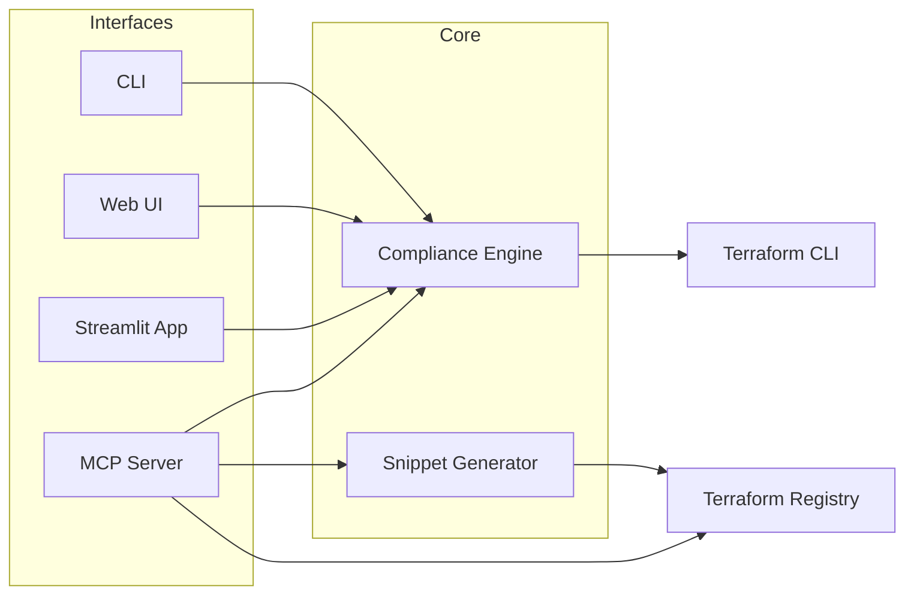

# Architecture

Terraform Guardrail MCP is organized into three layers: interfaces, compliance core, and integrations.

```mermaid
flowchart LR
    subgraph Interfaces
        CLI[CLI]
        MCP[MCP Server]
        WEB[Web UI]
        STL[Streamlit App]
    end

    subgraph Core
        SCAN[Compliance Engine]
        GEN[Snippet Generator]
    end

    REG[Terraform Registry]
    TF[Terraform CLI]

    CLI --> SCAN
    WEB --> SCAN
    STL --> SCAN
    MCP --> SCAN
    MCP --> GEN
    SCAN --> TF
    GEN --> REG
    MCP --> REG
```
