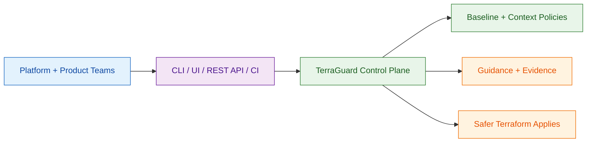
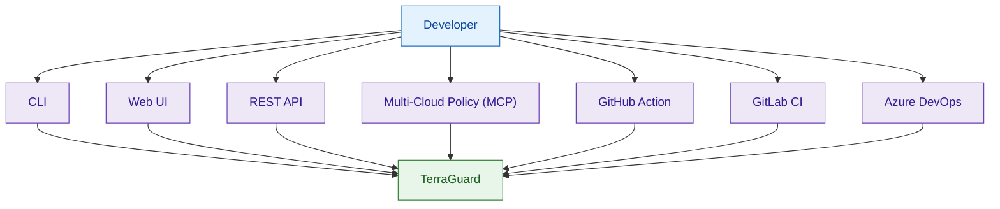
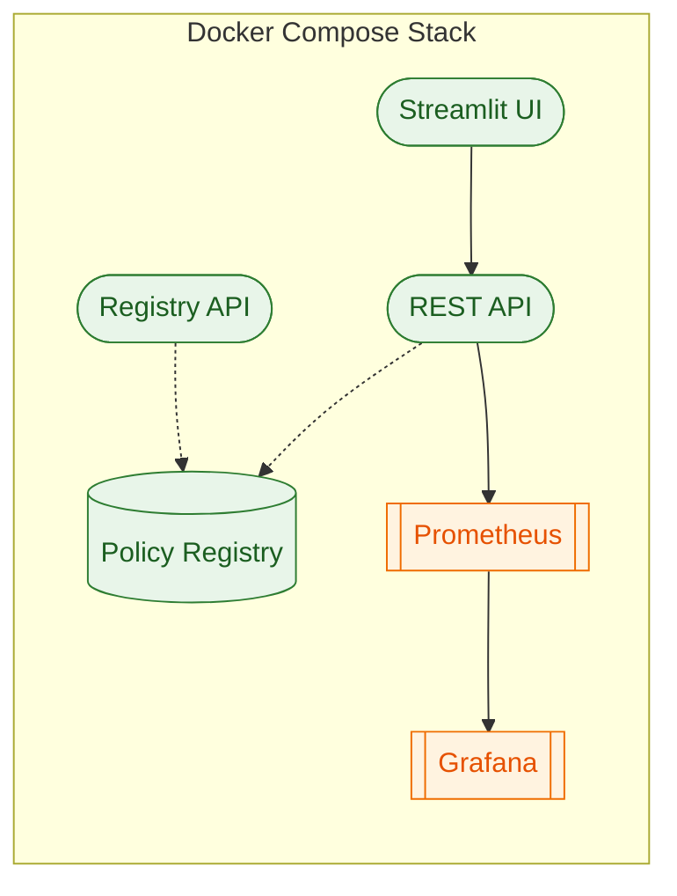

# Diagrams

## User Perspective



## Ways Developers Use Guardrail



## Docker Compose Stack (Local Dev)



## High-Level Architecture

```mermaid
flowchart TB
    subgraph Interfaces
        CLI([CLI])
        MCP([Multi-Cloud Policy (MCP) Server])
        WEB([Web UI])
        API([REST API])
        STL([Streamlit App])
    end

    subgraph Core
        SCAN((Compliance Engine))
        GEN[[Snippet Generator]]
        POLICY{Policy Layering}
    end

    subgraph Integrations
        TF[/Terraform CLI/]
        REG[(Terraform Registry)]
    end

    CLI --> SCAN
    WEB --> SCAN
    API --> SCAN
    STL --> SCAN
    MCP --> SCAN
    MCP --> GEN
    SCAN --> POLICY --> TF
    GEN --> REG

    classDef interface fill:#e3f2fd,stroke:#1e88e5,stroke-width:1px,color:#0d47a1;
    classDef core fill:#e8f5e9,stroke:#2e7d32,stroke-width:1px,color:#1b5e20;
    classDef integration fill:#fff3e0,stroke:#ef6c00,stroke-width:1px,color:#e65100;

    class CLI,MCP,WEB,API,STL interface;
    class SCAN,GEN,POLICY core;
    class TF,REG integration;
```

## Detailed Flow

```mermaid
flowchart TB
    INPUTS[Inputs: .tf, .tfvars, .tfstate] --> PARSE[Parse & Normalize]
    PARSE --> SCHEMA[Provider Schema + Metadata]
    SCHEMA --> RULES[Apply Guardrail Rules]
    RULES --> REPORT[Findings + Summary]
    REPORT --> OUTPUTS[CLI JSON / UI / Multi-Cloud Policy (MCP) / REST]
```
