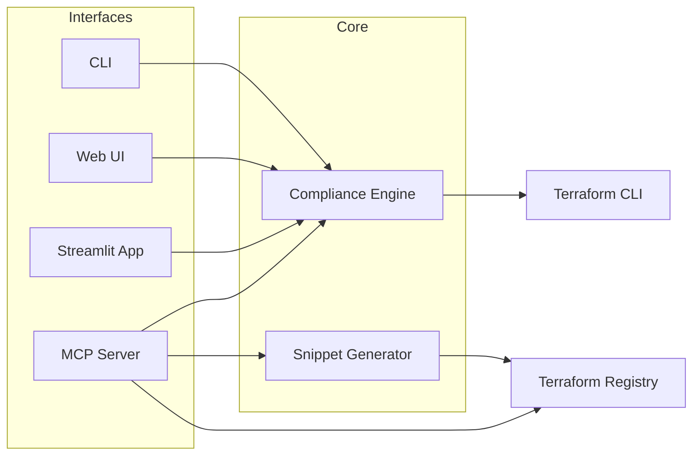
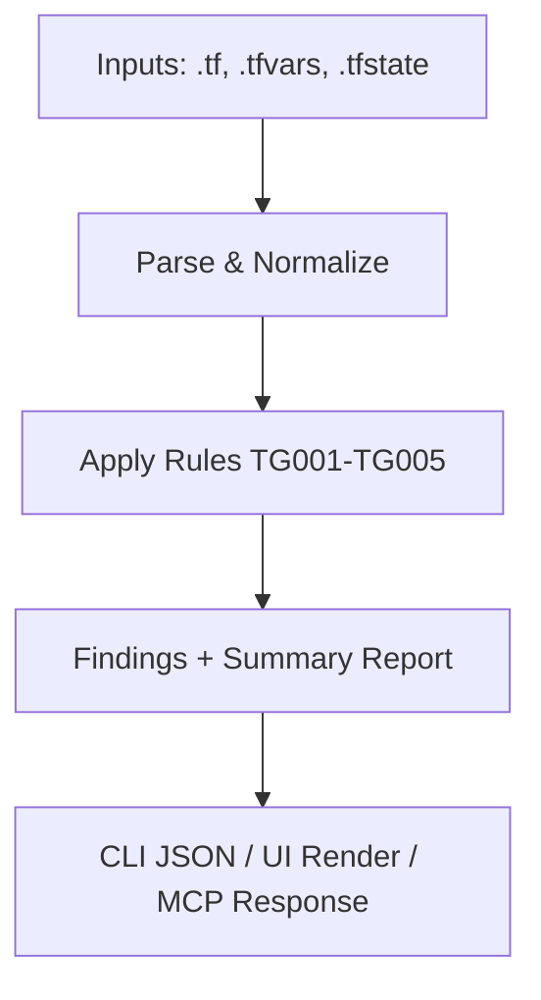

# Diagrams

## Architecture

```mermaid
flowchart LR
    subgraph Interfaces
        CLI[CLI]
        MCP[MCP Server]
        WEB[Web UI]
        STL[Streamlit App]
    end

    subgraph Core
        SCAN[Compliance Engine]
        GEN[Snippet Generator]
    end

    REG[Terraform Registry]
    TF[Terraform CLI]

    CLI --> SCAN
    WEB --> SCAN
    STL --> SCAN
    MCP --> SCAN
    MCP --> GEN
    SCAN --> TF
    GEN --> REG
    MCP --> REG
```

## Compliance Flow

```mermaid
flowchart TB
    INPUTS[Inputs: .tf, .tfvars, .tfstate] --> PARSE[Parse & Normalize]
    PARSE --> RULES[Apply Rules TG001-TG005]
    RULES --> REPORT[Findings + Summary Report]
    REPORT --> OUTPUT[CLI JSON / UI Render / MCP Response]
```
