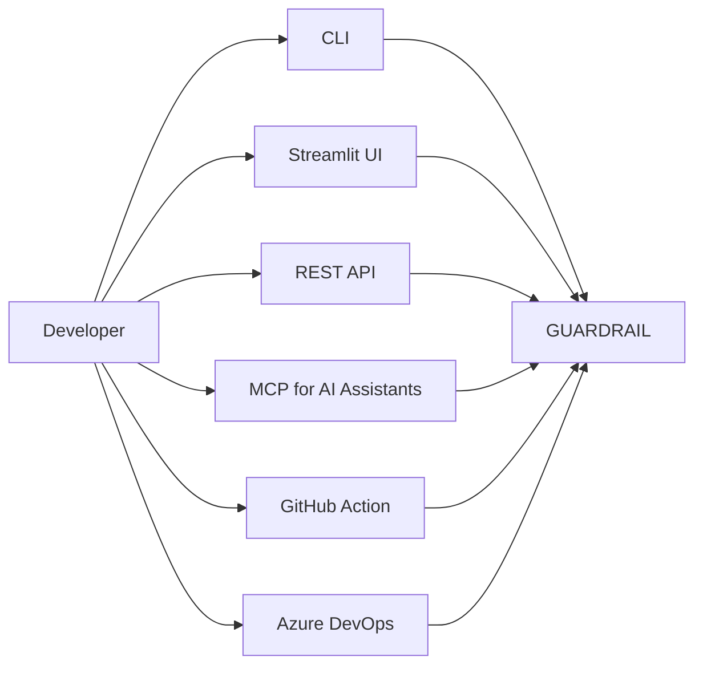
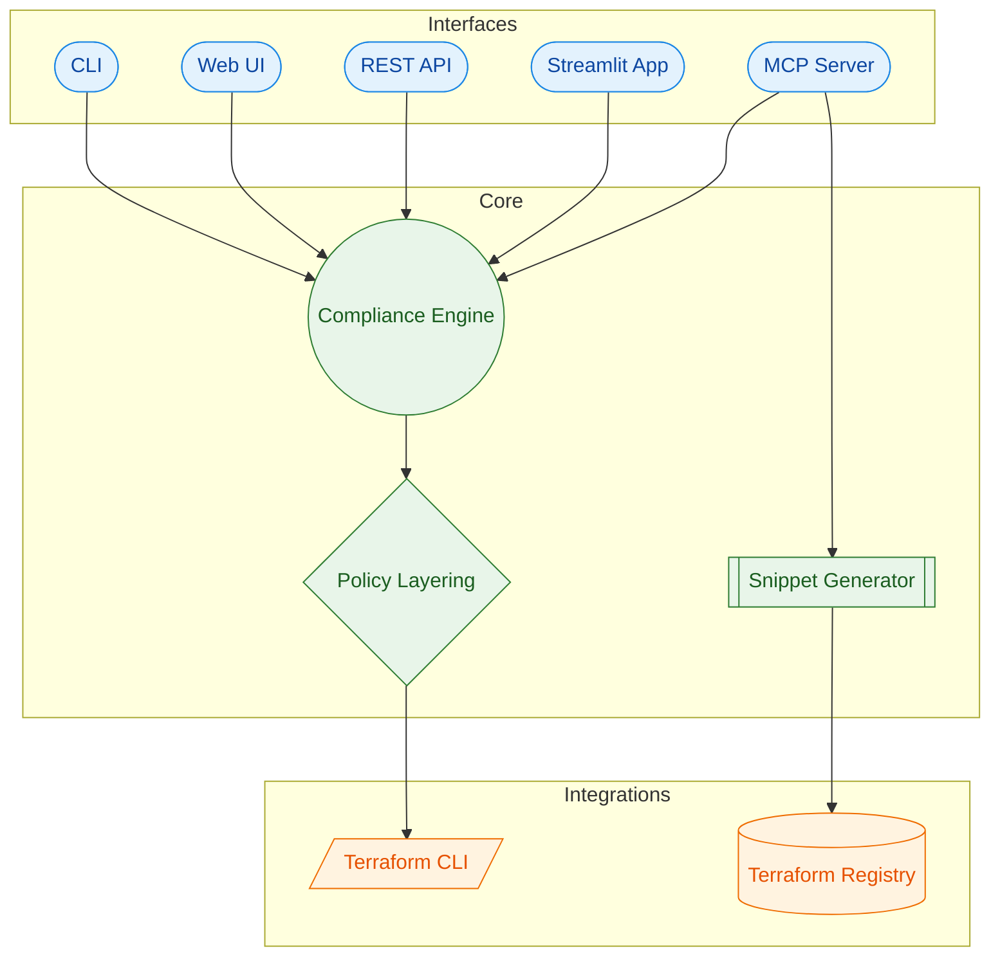
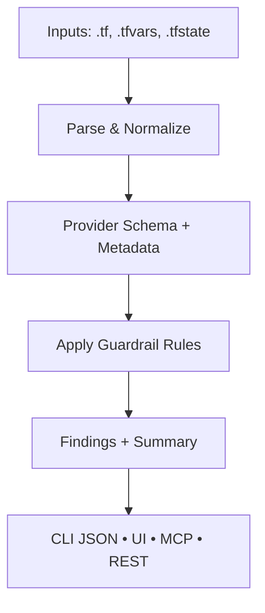

# Diagrams

## User Perspective

```mermaid
flowchart LR
    USER[Platform + Product Teams] --> CHANNELS[CLI • Streamlit • REST API • MCP]
    CHANNELS --> GUARDRAIL[Terraform Guardrail MCP (TerraGuard)]
    GUARDRAIL --> REPORTS[Readable Guidance + Evidence]
    GUARDRAIL --> TERRAFORM[Safer Terraform Applies]
```

## Ways Developers Use Guardrail



## Docker Compose Stack (Local Dev)


## High-Level Architecture



## Detailed Flow


