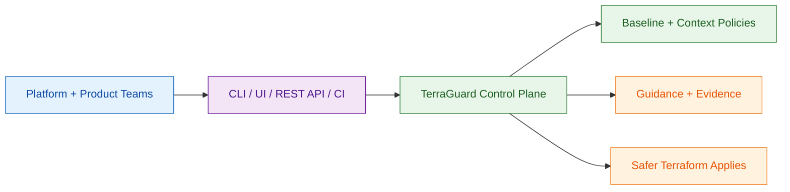
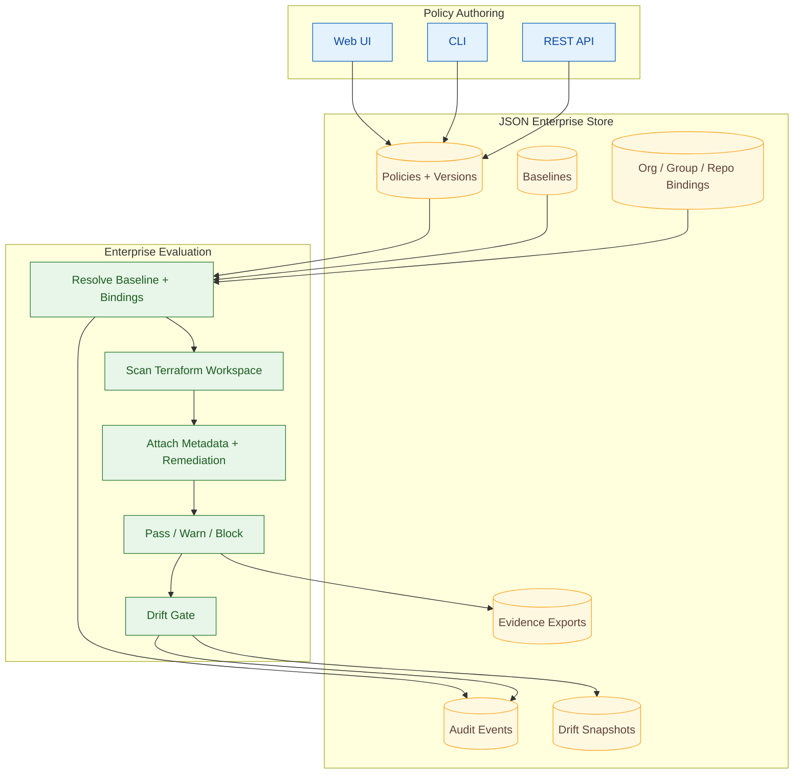
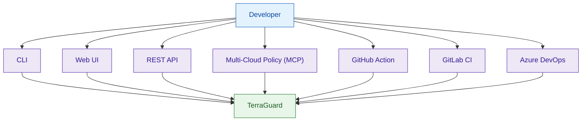
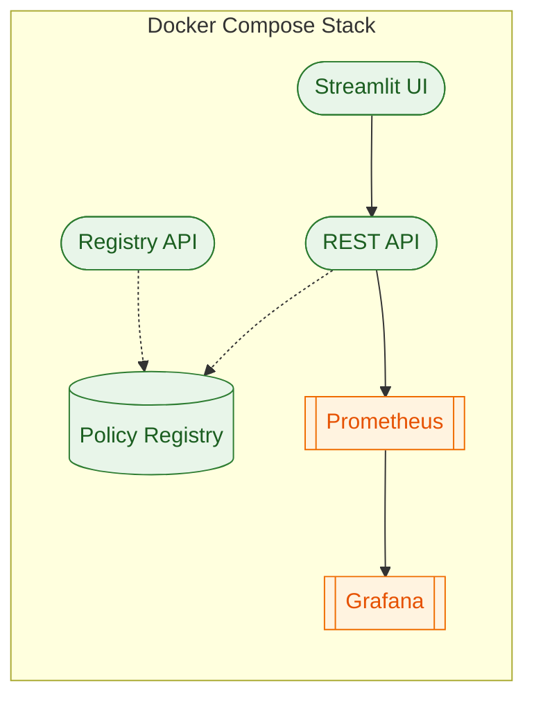
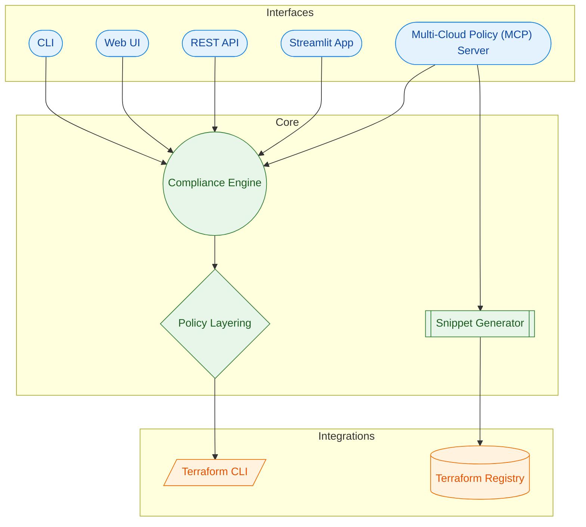
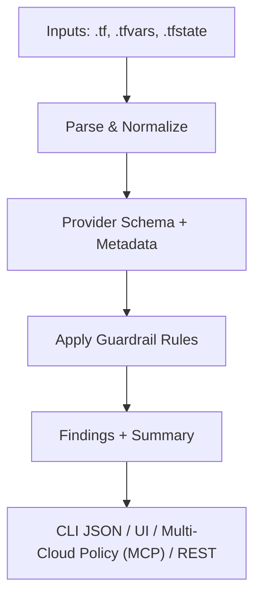
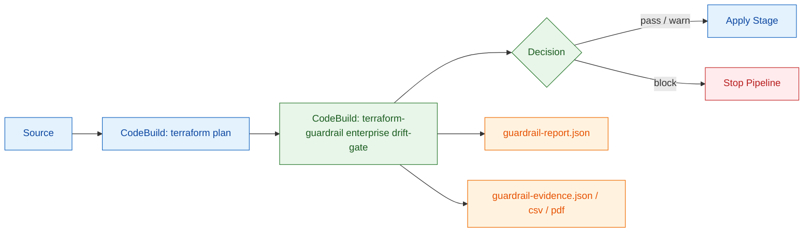

# Diagrams

## User Perspective

```mermaid
flowchart LR
    USER[Platform + Product Teams] --> CHANNELS[CLI / UI / REST API / CI]
    CHANNELS --> GUARDRAIL[TerraGuard Control Plane]
    GUARDRAIL --> POLICIES[Baseline + Context Policies]
    GUARDRAIL --> REPORTS[Guidance + Evidence]
    GUARDRAIL --> TERRAFORM[Safer Terraform Applies]

    classDef actor fill:#e3f2fd,stroke:#1565c0,stroke-width:1px,color:#0d47a1;
    classDef channel fill:#f3e5f5,stroke:#6a1b9a,stroke-width:1px,color:#4a148c;
    classDef core fill:#e8f5e9,stroke:#2e7d32,stroke-width:1px,color:#1b5e20;
    classDef output fill:#fff3e0,stroke:#ef6c00,stroke-width:1px,color:#e65100;

    class USER actor;
    class CHANNELS channel;
    class GUARDRAIL,POLICIES core;
    class REPORTS,TERRAFORM output;
```

## v2.0 Enterprise Control Plane

```mermaid
flowchart TB
    subgraph Authoring[Policy Authoring]
        UI[Web UI]
        CLI[CLI]
        API[REST API]
    end

    subgraph EnterpriseStore[JSON Enterprise Store]
        POL[(Policies + Versions)]
        BASE[(Baselines)]
        BIND[(Org / Group / Repo Bindings)]
        AUDIT[(Audit Events)]
        SNAP[(Drift Snapshots)]
        EVID[(Evidence Exports)]
    end

    subgraph Evaluation[Enterprise Evaluation]
        RESOLVE[Resolve Baseline + Bindings]
        SCAN[Scan Terraform Workspace]
        ENRICH[Attach Metadata + Remediation]
        DECIDE[Pass / Warn / Block]
        DRIFT[Drift Gate]
    end

    UI --> POL
    CLI --> POL
    API --> POL
    POL --> RESOLVE
    BASE --> RESOLVE
    BIND --> RESOLVE
    RESOLVE --> SCAN --> ENRICH --> DECIDE --> DRIFT
    DRIFT --> SNAP
    DECIDE --> EVID
    RESOLVE --> AUDIT
    DRIFT --> AUDIT

    classDef interface fill:#e3f2fd,stroke:#1565c0,stroke-width:1px,color:#0d47a1;
    classDef store fill:#fff8e1,stroke:#f9a825,stroke-width:1px,color:#5d4037;
    classDef eval fill:#e8f5e9,stroke:#2e7d32,stroke-width:1px,color:#1b5e20;

    class UI,CLI,API interface;
    class POL,BASE,BIND,AUDIT,SNAP,EVID store;
    class RESOLVE,SCAN,ENRICH,DECIDE,DRIFT eval;
```

## Ways Developers Use Guardrail

```mermaid
flowchart TB
    DEV[Developer] --> CLI[CLI]
    DEV --> UI[Web UI]
    DEV --> API[REST API]
    DEV --> MCP["Multi-Cloud Policy (MCP)"]
    DEV --> GHA[GitHub Action]
    DEV --> GL[GitLab CI]
    DEV --> ADO[Azure DevOps]

    CLI --> GUARDRAIL[TerraGuard]
    UI --> GUARDRAIL
    API --> GUARDRAIL
    MCP --> GUARDRAIL
    GHA --> GUARDRAIL
    GL --> GUARDRAIL
    ADO --> GUARDRAIL

    classDef actor fill:#e3f2fd,stroke:#1565c0,stroke-width:1px,color:#0d47a1;
    classDef channel fill:#ede7f6,stroke:#5e35b1,stroke-width:1px,color:#311b92;
    classDef core fill:#e8f5e9,stroke:#2e7d32,stroke-width:1px,color:#1b5e20;

    class DEV actor;
    class CLI,UI,API,MCP,GHA,GL,ADO channel;
    class GUARDRAIL core;
```

## Docker Compose Stack (Local Dev)

```mermaid
flowchart LR
    subgraph ComposeStack[Docker Compose Stack]
        UI([Streamlit UI])
        API([REST API])
        REG[(Policy Registry)]
        REGAPI([Registry API])
        PROM[[Prometheus]]
        GRAF[[Grafana]]
    end
    UI --> API
    API -.-> REG
    REGAPI -.-> REG
    API --> PROM
    PROM --> GRAF

    classDef core fill:#e8f5e9,stroke:#2e7d32,stroke-width:1px,color:#1b5e20;
    classDef optional fill:#fff3e0,stroke:#ef6c00,stroke-width:1px,color:#e65100;
    class UI,API,REG,REGAPI core;
    class PROM,GRAF optional;
```

## High-Level Architecture

```mermaid
flowchart TB
    subgraph Interfaces
        CLI([CLI])
        MCP(["Multi-Cloud Policy (MCP) Server"])
        WEB([Web UI])
        API([REST API])
        STL([Streamlit App])
    end

    subgraph Core
        SCAN((Compliance Engine))
        GEN[[Snippet Generator]]
        POLICY{Policy Layering}
    end

    subgraph Integrations
        TF[/Terraform CLI/]
        REG[(Terraform Registry)]
    end

    CLI --> SCAN
    WEB --> SCAN
    API --> SCAN
    STL --> SCAN
    MCP --> SCAN
    MCP --> GEN
    SCAN --> POLICY --> TF
    GEN --> REG

    classDef interface fill:#e3f2fd,stroke:#1e88e5,stroke-width:1px,color:#0d47a1;
    classDef core fill:#e8f5e9,stroke:#2e7d32,stroke-width:1px,color:#1b5e20;
    classDef integration fill:#fff3e0,stroke:#ef6c00,stroke-width:1px,color:#e65100;

    class CLI,MCP,WEB,API,STL interface;
    class SCAN,GEN,POLICY core;
    class TF,REG integration;
```

## Detailed Flow

```mermaid
flowchart TB
    INPUTS[Inputs: .tf, .tfvars, .tfstate] --> PARSE[Parse & Normalize]
    PARSE --> SCHEMA[Provider Schema + Metadata]
    SCHEMA --> RULES[Apply Guardrail Rules]
    RULES --> REPORT[Findings + Summary]
    REPORT --> OUTPUTS["CLI JSON / UI / Multi-Cloud Policy (MCP) / REST"]
```

## AWS CodePipeline Enterprise Gate

```mermaid
flowchart LR
    SRC[Source] --> PLAN[CodeBuild: terraform plan]
    PLAN --> GATE[CodeBuild: terraform-guardrail enterprise drift-gate]
    GATE --> DECISION{Decision}
    DECISION -->|pass / warn| APPLY[Apply Stage]
    DECISION -->|block| STOP[Stop Pipeline]
    GATE --> REPORT[guardrail-report.json]
    GATE --> EVIDENCE[guardrail-evidence.json / csv / pdf]

    classDef stage fill:#e3f2fd,stroke:#1565c0,stroke-width:1px,color:#0d47a1;
    classDef gate fill:#e8f5e9,stroke:#2e7d32,stroke-width:1px,color:#1b5e20;
    classDef artifact fill:#fff3e0,stroke:#ef6c00,stroke-width:1px,color:#e65100;
    classDef stop fill:#ffebee,stroke:#c62828,stroke-width:1px,color:#b71c1c;

    class SRC,PLAN,APPLY stage;
    class GATE,DECISION gate;
    class REPORT,EVIDENCE artifact;
    class STOP stop;
```
