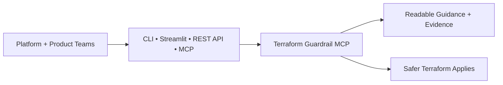

# Terraform Guardrail MCP Wiki

Terraform Guardrail MCP (Model Context Protocol) is a governance control plane for Infrastructure as
Code. It runs outside Terraform, exposes provider context, and enforces guardrails that prevent bad
state before apply.

## Design Principle

Non-negotiable safety floor, composable freedom above it. Guardrails live outside Terraform.

## User Perspective (High-Level)

## Quick links

- [Roadmap](Roadmap.md)
- [Architecture](Architecture.md)
- [Diagrams](Diagrams.md)
- [Comparison with Other Tools](Comparison.md)
- [CLI Usage](CLI-Usage.md)
- [MCP Server](MCP-Server.md)
- [Compliance Rules](Compliance-Rules.md)
- [Streamlit Deployment](Streamlit-Deployment.md)
- [Live Streamlit App](https://terraform-guardrail.streamlit.app/)
- [PyPI Package](https://pypi.org/project/terraform-guardrail/)
- [Release Process](Release-Process.md)

## Latest Release

- Version: 0.2.7
- Container image: https://github.com/Huzefaaa2/terraform-guardrail/pkgs/container/terraform-guardrail
- Supported providers: AWS, Azure, GCP, Kubernetes, Helm, OCI, Vault, Alicloud, vSphere

## Feature Matrix

| Area | CLI | Web UI / Streamlit |
| --- | --- | --- |
| Config scan (`.tf`, `.tfvars`, `.hcl`) | Yes | Yes |
| State leak scan (`.tfstate`) | Yes | Yes |
| Schema-aware validation | Yes | Yes |
| CSV export | No | Yes |
| Provider metadata | Yes | Yes |
| Snippet generation | Yes | No |
| Multi-file scan | Yes (directory) | Yes (upload up to 10) |
