# Terraform Guardrail MCP Wiki

Terraform Guardrail MCP (Model Context Protocol) is a governance control plane for Infrastructure as
Code. It runs outside Terraform, exposes provider context, and enforces guardrails that prevent bad
state before apply.

## Terraform-Guardrail MCP

**Making Infrastructure Governance Executable**

## The Problem We’re Solving

Despite using Terraform and security scanners, enterprises still face:

- Inconsistent enforcement across teams
- Policies applied too late in delivery
- Manual reviews that don’t scale
- Different interpretations of “standards”
- Audit findings caused by drift, not intent

👉 The issue is not lack of tools —  
👉 The issue is lack of a governance distribution mechanism.

## What Terraform-Guardrail MCP Is

Terraform-Guardrail MCP is a governance control plane for Terraform.

It:

- Establishes a non-negotiable safety floor
- Distributes guardrails consistently via CI/CD
- Enables progressive enforcement (Advisory → Warn → Strict)
- Makes governance versioned, auditable, and repeatable

Governance becomes code, not documents.

## Where It Fits (Ecosystem View)

| Layer | Role |
| --- | --- |
| Terraform-Guardrail MCP | Governance & enforcement orchestration |
| Checkov / tfsec / Terrascan | Deep static security & compliance scanning |
| OPA / Sentinel | Advanced & runtime policy enforcement |
| CI/CD (GitLab/GitHub) | Execution & control point |

Terraform-Guardrail does not replace existing tools — it connects and operationalizes them.

## How It Works (In One Line)

Every Terraform change passes through the same guardrails, before it ever reaches the cloud.

Implemented at:

- Merge request / pull request stage
- GitLab group-level CI enforcement
- No per-repo negotiation

## Enterprise Adoption Model

| Phase | Mode | Business Outcome |
| --- | --- | --- |
| Phase 1 | Advisory | Visibility, zero disruption |
| Phase 2 | Warn | Accountability without blocking |
| Phase 3 | Strict | Mandatory compliance for prod |

✔ No “big-bang” rollout  
✔ Teams keep autonomy above the safety floor

## Why Enterprises Adopt Terraform-Guardrail

Without it:

- Governance relies on people & process
- Controls drift over time
- Audit remediation is expensive

With it:

- Governance is automatic and consistent
- Security shifts left into CI
- Audit evidence is generated by default
- Platform teams scale without becoming bottlenecks

## Bottom Line (Executive Takeaway)

Terraform-Guardrail MCP turns infrastructure governance  
from guidelines into guarantees.

It enables speed and safety — without trading one for the other.

## Design Principle

Non-negotiable safety floor, composable freedom above it. Guardrails live outside Terraform.

## User Perspective (High-Level)

```mermaid
flowchart LR
    USER[Platform + Product Teams] --> CHANNELS[CLI • Streamlit • REST API • MCP]
    CHANNELS --> GUARDRAIL[Terraform Guardrail MCP]
    GUARDRAIL --> REPORTS[Readable Guidance + Evidence]
    GUARDRAIL --> TERRAFORM[Safer Terraform Applies]
```

## Quick links

- [Roadmap](Roadmap.md)
- [Architecture](Architecture.md)
- [Diagrams](Diagrams.md)
- [Comparison with Other Tools](Comparison.md)
- [CLI Usage](CLI-Usage.md)
- [GitHub Action](GitHub-Action.md)
- [Packaging](Packaging.md)
- [MCP Server](MCP-Server.md)
- [Compliance Rules](Compliance-Rules.md)
- [Streamlit Deployment](Streamlit-Deployment.md)
- [Docker Compose Stack](Docker-Compose.md)
- [Live Streamlit App](https://terraform-guardrail.streamlit.app/)
- [PyPI Package](https://pypi.org/project/terraform-guardrail/)
- [Release Process](Release-Process.md)

## Latest Release

- Version: 0.2.11
- Container image: https://github.com/Huzefaaa2/terraform-guardrail/pkgs/container/terraform-guardrail
- Supported providers: AWS, Azure, GCP, Kubernetes, Helm, OCI, Vault, Alicloud, vSphere
- Local stack: Docker Compose (API + UI + policy registry, optional analytics)
- Policy registry: OPA bundles published under `/bundles/*.tar.gz`
- Policy evaluation available via CLI when OPA is installed

## Feature Matrix

| Area | CLI | Web UI / Streamlit |
| --- | --- | --- |
| Config scan (`.tf`, `.tfvars`, `.hcl`) | Yes | Yes |
| State leak scan (`.tfstate`) | Yes | Yes |
| Schema-aware validation | Yes | Yes |
| CSV export | No | Yes |
| Provider metadata | Yes | Yes |
| Snippet generation | Yes | No |
| Multi-file scan | Yes (directory) | Yes (upload up to 10) |
