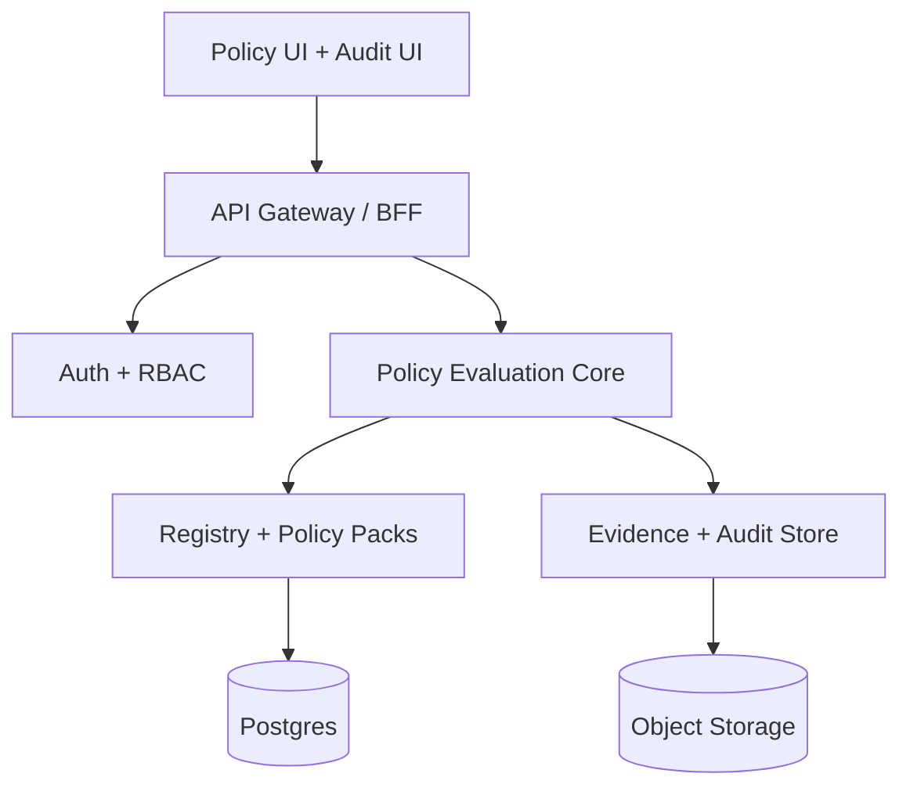

# Enterprise Implementation Plan

This plan outlines modular, safe, incremental delivery for TerraGuard’s enterprise scope.

## Modular Architecture (Target)



## Policy Authoring UI

**UI schema**

```
Policy:
  id, name, description
  category: security | cost | resiliency | compliance
  severity: info | warn | block
  scope: org | group | repo
  providers: [aws, azurerm, google, ...]
  rule_type: rego | native | invariant
  rule_body
  metadata: { standard, control_id, owner, expiry }
  status: draft | approved | deprecated
  version
```

**API**

- `POST /policies`
- `PUT /policies/{id}`
- `GET /policies/{id}`
- `GET /policies?scope=org`

**DB**

- `policies`
- `policy_versions`
- `policy_metadata`

## Org-Wide Baselines

**Model**

- `baseline_policy = true`
- Resolution order: baseline → pack → environment → app

**API**

- `POST /baselines`
- `GET /baselines`

**DB**

- `baselines`
- `baseline_bindings`

## Group-Level Enforcement

**Model**

- org → group → subgroup → repo inheritance

**API**

- `POST /integrations/gitlab/groups`
- `GET /integrations/gitlab/groups/{id}/policies`

**DB**

- `gitlab_groups`
- `group_policy_bindings`

## Policy Versioning + Approvals

**Workflow**

- Draft → Review → Approved → Active → Deprecated

**API**

- `POST /policies/{id}/versions`
- `POST /policies/{id}/approve`
- `GET /policies/{id}/versions`

**DB**

- `policy_versions`
- `policy_approvals`

## Audit Trails

**Events**

- policy create/update/delete
- approval actions
- evaluation results
- export events

**DB**

- `audit_events` (actor, action, resource, timestamp, metadata json)

## Evidence Export (SOC2 / ISO / PCI)

**Outputs**

- PDF, CSV, JSON evidence bundles

**API**

- `POST /exports`
- `GET /exports/{id}`

**Storage**

- Object storage with immutable evidence archives

## Drift Detection Expansion

**Inputs**

- last approved policy set
- current repo/state

**API**

- `POST /drift/check`

**DB**

- `drift_snapshots`
- `drift_findings`

## Guardrails-as-a-Service API

**Flow**

CI → `POST /evaluate` → policy engine → pass/warn/block + evidence URL

**API**

- `POST /evaluate`
- `GET /results/{id}`

**DB**

- `evaluations`
- `evaluation_findings`

## Enterprise Policy Packs

**Structure**

```
packs/
  pci-dss/
    policies/
    metadata.yaml
  banking/
  azure-landing-zone/
```

**API**

- `GET /packs`
- `GET /packs/{id}`

**DB**

- `policy_packs`
- `pack_versions`

## Suggested Fixes + Recommendations

**Model**

- attach remediation guidance per rule
- severity-based recommendation templates

**DB**

- `rule_recommendations`

## Context-Aware Evaluation

**Signals**

- environment, risk tier, previous violations

**API**

- `POST /evaluate` with `context`

**DB**

- `risk_profiles`

## Modular Delivery Plan

1. Enterprise data model + API scaffolding.
2. Baselines + policy approvals + audit trails.
3. Evidence exports + policy packs.
4. Guardrails-as-a-Service API.
5. Intelligent evaluation and suggestions.
